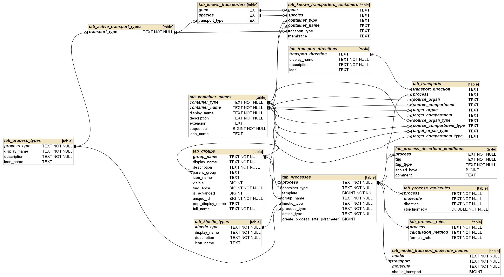
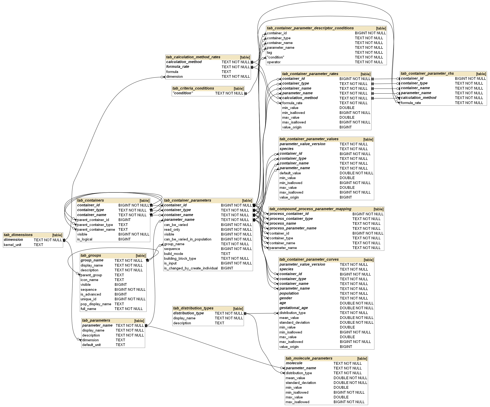
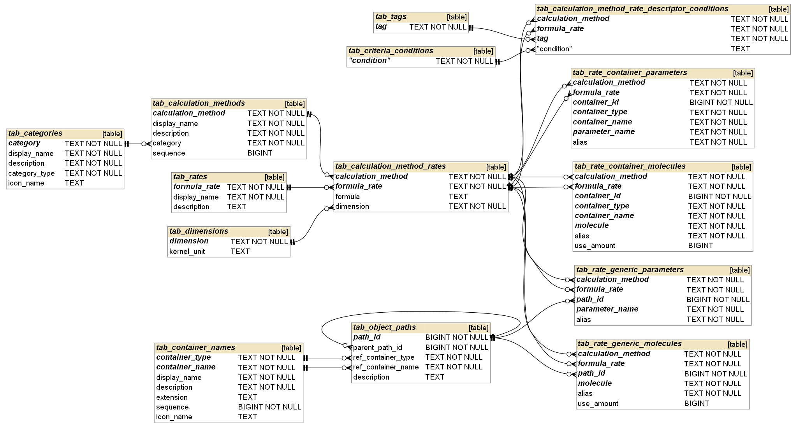
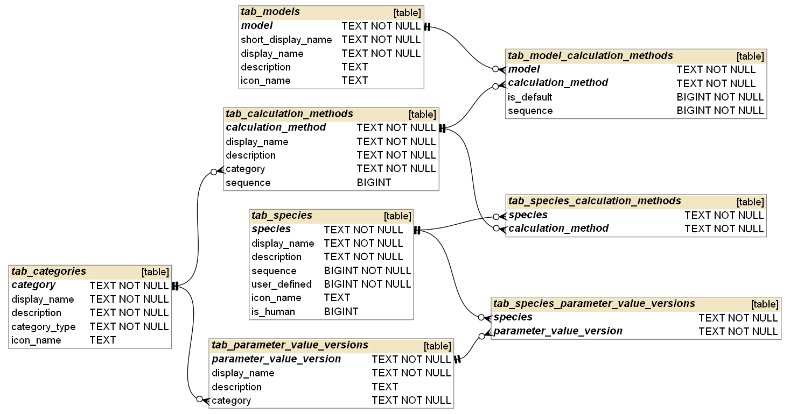
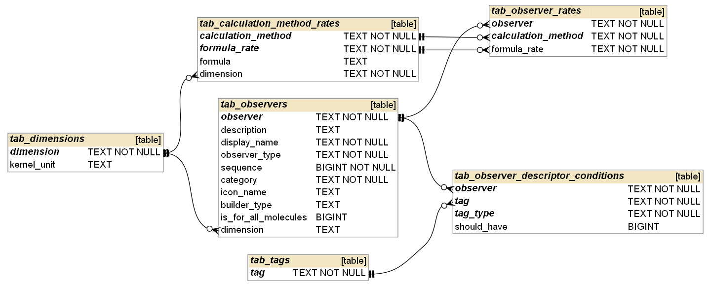
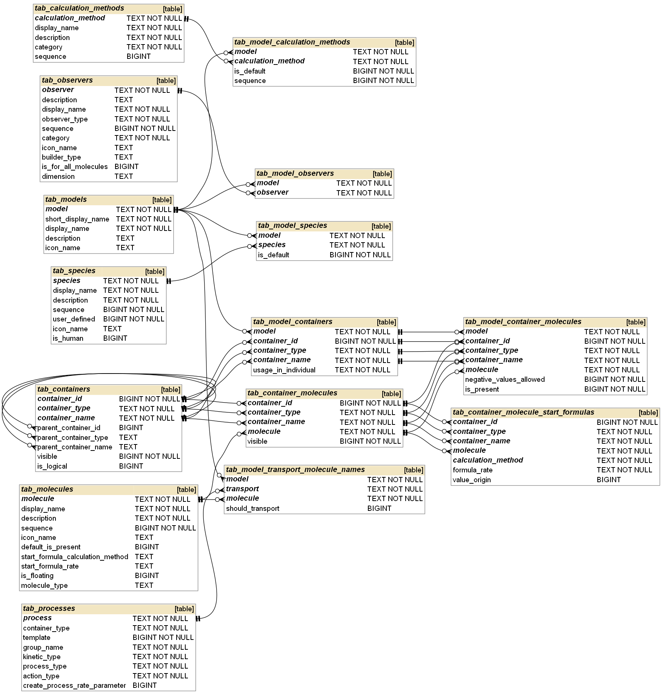

# General remarks

Some of the common properties used in many tables:

* **display_name** The name of the entity to be used in the UI in PK-Sim.

  NOTE: MoBi does not support the "display name" concept, so all entities are displayed with their internal name. Also within a model all objects are stored with their internal name. It is therefore advisable to keep the display name the same as the internal name. Exceptions are e.g. special characters like "*", "|" etc. which cannot be used in internal names. 

* **description** Longer description of the entity, which is displayed as a tooltip in PK-Sim and can be edited in MoBi.

* **sequence** Used to sort objects in the UI (unless another sorting algorithm applies, e.g. alphabetical).

* **icon_name** Defines which icon is used for the entity. 

  If not empty: the icon with the given name must be present in the `OSPSuite.Assets.Images`

Boolean values are always represented as **integers restricted to {0, 1}**.

# Overview diagrams

Each of the following subsections focuses on one aspect and shows only a **subset** of the database tables relevant to that topic. The last subsection shows the complete schema with all tables.

## Containers

A *container* is a model entity that can have children. 
In the context of PK-Sim, everything except parameters and observers is a container.

**tab_container_names** describes an abstract container (e.g. "Plasma"), which can be inserted at various places in the container structure defined in **tab_containers**.

* **container_type** is used, for example, to map a container to the correct container class in PK-Sim.
* **extension** is not used by PK-Sim and is only useful for some database update scripts.
* **icon_name** defines which icon is used for a container. 

**tab_containers** defines the container hierarchy and includes **all possible containers** which can appear in a model. When a model is created, some containers are filtered out based on the information in **tab_model_containers** and **tab_population_containers** (s. below)

* Each container within a hierarchy is identified by the combination 
  `{container_id, container_type, container_name}`. 

  * `container_id` is unique across all containers. In principle, it would be sufficient to use only the *container id* as the primary key. Container type and container name have been included in the primary key for convenience (e.g. when querying data from other tables, it is not always necessary to include *tab_containers* and *tab_container_names* etc.). 

* Each container can have a parent container defined by the combination
  `{parent_container_id, parent_container_type, parent_container_name}`. 

  * Containers that appear at the top level of the *Spatial Structure* are defined as children of the special `ROOT` container. The `ROOT` container itself has no parent.

    | container_id | container_type | container_name     | parent_container_id | parent_container_type | parent_container_name |
    | ------------ | -------------- | ------------------ | ------------------- | --------------------- | --------------------- |
    | 146          | ORGANISM       | Organism           | 145                 | SIMULATION            | ROOT                  |
    | 777          | GENERAL        | Neighborhoods      | 145                 | SIMULATION            | ROOT                  |
    | 1026         | GENERAL        | MoleculeProperties | 145                 | SIMULATION            | ROOT                  |
    | 4205         | GENERAL        | Events             | 145                 | SIMULATION            | ROOT                  |

  * Top containers of other building blocks (Passive Transports, Reactions, Events, Formulations, ...) are all defined as containers without a parent. 

* **tab_containers.visible** defines if a container is shown in PK-Sim in hierarchy view (TODO rename column to **is_visible**).

* **tab_containers.is_logical** defines if a container is *physical* or *logical* (s. the [OSP documentation](https://docs.open-systems-pharmacology.org/working-with-mobi/mobi-documentation/model-building-components#spatial-structures) for details).

**tab_container_tags** describes which additional tags are added to a container.

* the **name** of a container is always added as a tag programmatically and does not need to be added here.

**tab_neighborhoods** defines 2 neighbor containers for each neighborhood of a spatial structure

* There are no rules or restrictions as to which of 2 adjacent containers must be defined as the first and which as the second container. For example, passive transports are defined by the container criteria of their source and target containers, and changing the first and second neighbour containers does not affect the later creation of the transport. Care should only be taken when using the keywords FIRST_NEIGHBOR and SECOND_NEIGHBOR in the formulas. 
  * Even in the latter case, swapping neighbors may not be critical. E.g. if both neighbor containers have **the same parent container** and the formula uses the path `FIRST_NEIGHBOR|..|Parameter1`, then swapping the formula path with `SECOND_NEIGHBOR|..|Parameter1`would result in the same formula, because F`IRST_NEIGHBOR|..` and `SECOND_NEIGHBOR|..` both point to the same container, making the formula invariant with respect to neighbor switching. 
  * But if the formula refers e.g. to `FIRST_NEIGHBOR|Parameter1` - then the neighbor order is relevant.

**tab_population_containers** defines which containers are created in individual/population building blocks in PK-Sim. For each population, this is a subset of the containers defined in *tab_containers*. 

**tab_model_containers** defines which containers **can** be included into the final model. Whether a container is included into the model is estimated based on the value of the column **usage_in_individual** as following:

* if `usage_in_individual = REQUIRED`
  * if the container is available in the individual/population building block used for the model creation: container is added to the model
  * otherwise: error, model cannot be created
* if `usage_in_individual = OPTIONAL`
  * if the container is available in the individual/population building block used for the model creation: container is added to the model
  * otherwise: container is NOT added to the model
* if `usage_in_individual = EXTENDED`
  * container is added to the model in any case
  * containers of this type usually should not be defined in *tab_population_containers* (TODO https://github.com/Yuri05/DB_Questions/discussions/1)

## Processes

*Processes* are defined as containers with `container_type="PROCESS"` and must be inserted into **tab_container_names** first; once done they can be inserted into **tab_processes** and further process-specific tables.

**tab_processes** contains the following information about a process:

* **template** defines whether a process is always added to the selected model or only on demand.

  * For example, all passive transports or FcRn binding reactions in a protein model have `template = 0`

  * For example, active transports or metabolization reactions which are added only if the corresponding process was configured in a simulation in PK-Sim have `template = 1`

* **group_name** is used to identify where (in which building blocks or simulations) the processes are used in PK-Sim.

  * Processes with the **parent** group *COMPOUND_PROCESSES* are templates for active processes (active transport, specific binding, elimination, metabolization, inhibition, induction, ...) used in the compound building block of PK-Sim.
  * Processes with the group *APPLICATION* are application transports.
  * Processes with the group *INDIVIDUAL_ACTIVE_PROCESS* are templates for *active transports*, used in an *Expression Profile* building block. These templates have no parameters and are further specified in **tab_transports** (s. below).
  * Processes with the group *PROTEIN* describe *production* and *degradation* of proteins (enzymes, transporters, binding partners).
  * Processes with the group *SIMULATION_ACTIVE_PROCESS* describe the processes which are created in a simulation from both compound process template and individual (expression profile) process template.
  * Processes with the group *UNDEFINED* are processes where the group is not relevant (typically all *passive* processes).

    | GROUP_NAME                    | PARENT_GROUP       |
    | ----------------------------- | ------------------ |
    | ACTIVE_TRANSPORT              | COMPOUND_PROCESSES |
    | ACTIVE_TRANSPORT_INTRINSIC    | COMPOUND_PROCESSES |
    | APPLICATION                   |                    |
    | ENZYMATIC_STABILITY           | COMPOUND_PROCESSES |
    | ENZYMATIC_STABILITY_INTRINSIC | COMPOUND_PROCESSES |
    | INDIVIDUAL_ACTIVE_PROCESS     |                    |
    | INDUCTION_PROCESSES           | COMPOUND_PROCESSES |
    | INHIBITION_PROCESSES          | COMPOUND_PROCESSES |
    | PROTEIN                       |                    |
    | SIMULATION_ACTIVE_PROCESS     |                    |
    | SPECIFIC_BINDING              | COMPOUND_PROCESSES |
    | SYSTEMIC_PROCESSES            | COMPOUND_PROCESSES |
    | UNDEFINED                     |                    |

* **kinetic_type** is used for the mapping
  `{Compound process template, Individual process template} ▶️ Simulation process`
  
  Example: active transports
  * for the active transports there are currently 2 compound templates:

    | process                      | group_name       | kinetic_type |
    | ---------------------------- | ---------------- | ------------ |
    | ActiveTransportSpecific_Hill | ACTIVE_TRANSPORT | Hill         |
    | ActiveTransportSpecific_MM   | ACTIVE_TRANSPORT | MM           |

  * there are different individual active transport templates - specified by their source and target (Interstitial<=>Intracellular, Interstitial<=>Plasma, Blood Cells <=> Plasma etc.)
  (kinetic type is not specified on the individual building block level and thus is set to "*Undefined*")

    | process                                              | group_name                | kinetic_type |
    | :--------------------------------------------------- | ------------------------- | ------------ |
    | ActiveEffluxSpecificIntracellularToInterstitial | INDIVIDUAL_ACTIVE_PROCESS | Undefined    |
    | ActiveInfluxSpecificInterstitialToIntracellular | INDIVIDUAL_ACTIVE_PROCESS | Undefined    |
    | ActiveEffluxSpecificInterstitialToPlasma        | INDIVIDUAL_ACTIVE_PROCESS | Undefined    |
    | ActiveInfluxSpecificPlasmaToInterstitial        | INDIVIDUAL_ACTIVE_PROCESS | Undefined    |
    |  ...       | ...                       | ...          |

  * In the simulation
    * `ActiveTransportSpecific_MM (Compound) +   
    ActiveEffluxSpecificIntracellularToInterstitial (Individual) ▶️ 
    ActiveEffluxSpecificIntracellularToInterstitial_MM (Simulation)`

    * `ActiveTransportSpecific_Hill (Compound) + 
    ActiveEffluxSpecificIntracellularToInterstitial (Individual) ▶️ 
    ActiveEffluxSpecificIntracellularToInterstitial_Hill (Simulation)`

    | process                                              | group_name                | kinetic_type |
    | :--------------------------------------------------- | ------------------------- | ------------ |
    | ActiveEffluxSpecificIntracellularToInterstitial_Hill | SIMULATION_ACTIVE_PROCESS | Hill         |
    | ActiveEffluxSpecificIntracellularToInterstitial_MM   | SIMULATION_ACTIVE_PROCESS | MM           |
    | ActiveInfluxSpecificInterstitialToIntracellular_Hill | SIMULATION_ACTIVE_PROCESS | Hill         |
    | ActiveInfluxSpecificInterstitialToIntracellular_MM   | SIMULATION_ACTIVE_PROCESS | MM           |
    | ActiveEffluxSpecificInterstitialToPlasma_Hill        | SIMULATION_ACTIVE_PROCESS | Hill         |
    | ActiveEffluxSpecificInterstitialToPlasma_MM          | SIMULATION_ACTIVE_PROCESS | MM           |
    | ActiveInfluxSpecificPlasmaToInterstitial_Hill        | SIMULATION_ACTIVE_PROCESS | Hill         |
    | ActiveInfluxSpecificPlasmaToInterstitial_MM          | SIMULATION_ACTIVE_PROCESS | MM           |
    | ...                                                  | ...                       | ...          |

* **process_type** is used for more detailed process specification within a group. (TODO better description)

  | group_name                    | process_type             |
  | ----------------------------- | ------------------------ |
  | ACTIVE_TRANSPORT              | ActiveTransport          |
  | ACTIVE_TRANSPORT_INTRINSIC    | ActiveTransport          |
  | APPLICATION                   | Application              |
  | ENZYMATIC_STABILITY           | Metabolization           |
  | ENZYMATIC_STABILITY_INTRINSIC | Metabolization           |
  | INDIVIDUAL_ACTIVE_PROCESS     | BiDirectional            |
  | INDIVIDUAL_ACTIVE_PROCESS     | Efflux                   |
  | INDIVIDUAL_ACTIVE_PROCESS     | Influx                   |
  | INDIVIDUAL_ACTIVE_PROCESS     | PgpLike                  |
  | INDUCTION_PROCESSES           | Induction                |
  | INHIBITION_PROCESSES          | CompetitiveInhibition    |
  | INHIBITION_PROCESSES          | IrreversibleInhibition   |
  | INHIBITION_PROCESSES          | MixedInhibition          |
  | INHIBITION_PROCESSES          | NoncompetitiveInhibition |
  | INHIBITION_PROCESSES          | UncompetitiveInhibition  |
  | PROTEIN                       | Creation                 |
  | SIMULATION_ACTIVE_PROCESS     | BiDirectional            |
  | SIMULATION_ACTIVE_PROCESS     | Efflux                   |
  | SIMULATION_ACTIVE_PROCESS     | Induction                |
  | SIMULATION_ACTIVE_PROCESS     | Influx                   |
  | SIMULATION_ACTIVE_PROCESS     | IrreversibleInhibition   |
  | SIMULATION_ACTIVE_PROCESS     | PgpLike                  |
  | SPECIFIC_BINDING              | SpecificBinding          |
  | SYSTEMIC_PROCESSES            | Elimination              |
  | SYSTEMIC_PROCESSES            | EliminationGFR           |
  | SYSTEMIC_PROCESSES            | Metabolization           |
  | SYSTEMIC_PROCESSES            | Secretion                |
  | UNDEFINED                     | Passive                  |

* **action_type** is one of {`APPLICATION`, `INTERACTION`, `REACTION`, `TRANSPORT`} (TODO better description)

* **create_process_rate_parameter** defines if the `Process Rate` parameter should be created for transport or reaction (s. [OSP Suite documentation](https://docs.open-systems-pharmacology.org/working-with-mobi/mobi-documentation/model-building-components#reactions-and-molecules) for details.)

**tab_process_descriptor_conditions** describes source and target container criteria for transports and source container criteria for reactions

* **tag_type** can be one of `{SOURCE, TARGET}`

**tab_process_molecules** describes the reactions which are **always** part of a model (like e.g. *FcRn binding* in the large molecules model)
(TODO rename the table, s. the issue https://github.com/Open-Systems-Pharmacology/PK-Sim/issues/2309)

* **direction** can be of `IN` (educt), `OUT` (product) or `MODIFIER`

**tab_process_rates** describes the rate (kinetic) of a process

* Template processes with the **parent** group **COMPOUND_PROCESSES** and processes with the group **INDIVIDUAL_ACTIVE_PROCESS** always have `Zero_Rate` formula, because they are used in the corresponding building blocks where the process rate does not matter. The real rate is then set for the corresponding **simulation** process, e.g. 

  | process                                            | calculation_method | formula_rate                                   |
  | -------------------------------------------------- | ------------------ | ---------------------------------------------- |
  | ActiveTransportSpecific_MM                         | LinksCommon        | Zero_Rate                                      |
  | ActiveEffluxSpecificIntracellularToInterstitial    | LinksCommon        | Zero_Rate                                      |
  | ActiveEffluxSpecificIntracellularToInterstitial_MM | LinksCommon        | ActiveEffluxSpecificWithTransporterInTarget_MM |

**tab_model_transport_molecule_names** restricts which molecules are transported by a passive transport for particular model. As per default, passive transport will transfer all floating molecules from its source container to the target container. In this table, some molecules can be excluded (`should_transport=0`) or transport can be restricted only to the specific molecules (`should_transport=1`). S. the [Passive Transports documentation](https://docs.open-systems-pharmacology.org/working-with-mobi/mobi-documentation/model-building-components#passive-transports) 
(TODO rename the table, s. the issue https://github.com/Open-Systems-Pharmacology/PK-Sim/issues/2309)

**tab_transports** defines which active transports can be created in the model. 
(TODO better description)
(TODO rename the table, s. the issue https://github.com/Open-Systems-Pharmacology/PK-Sim/issues/2309)
(TODO https://github.com/Yuri05/DB_Questions/discussions/5)

**tab_transport_directions** defines all available transport directions
(TODO rename the table, s. the issue https://github.com/Open-Systems-Pharmacology/PK-Sim/issues/2309)

**tab_known_transporters** Defines a *global* transporter direction for a `{Species, Gene}` combination. 
When adding a transporter in PK-Sim that is not available in this data table: the transporter direction is set to default and the user is informed that the transporter was not found in the database.
See [Localizations, directions, and initial concentrations of transport proteins](https://docs.open-systems-pharmacology.org/working-with-pk-sim/pk-sim-documentation/pk-sim-expression-profile#localizations-directions-and-initial-concentrations-of-transport-proteins) in the OSP Suite documentation.

**tab_known_transporters_containers** The *global* transporter direction defines the default transporter direction and polarity in each organ. However, some organs may have different transporter properties. To account for this, the *local* transporter direction and/or polarity can be overridden in some organs by entries in this table.
See [Localizations, directions, and initial concentrations of transport proteins](https://docs.open-systems-pharmacology.org/working-with-pk-sim/pk-sim-documentation/pk-sim-expression-profile#localizations-directions-and-initial-concentrations-of-transport-proteins) in the OSP Suite documentation.

## Species and populations

*Species* defines the type of an individual (Human, Dog, Rat, Mouse, ...)

*Population* defines a subtype of a species. For each species, 1 or more populations can be defined.

**tab_species** defines a species.

* **user_defined** (TODO https://github.com/Yuri05/DB_Questions/discussions/6)

* **is_human** (TODO https://github.com/Yuri05/DB_Questions/discussions/7)

**tab_populations** defines which populations are available for a given species.

* **is_age_dependent** Specifies whether some population parameters have age-dependent information (such parameters are then defined in **tab_container_parameter_curves**). If a population is age dependent:
  * Age must be provided as an input when creating an individual
  * Age range must be provided as an input when creating a population
  * *Aging* option is available when creating a simulation
  * Age dependent *ontogeny information* will be used for proteins etc.
* **is_height_dependent** Specifies whether height information is available for the given population. If a population is height dependent:
  * Height must be provided as an input when creating an individual
  * Height range must be provided as an input when creating a population
  * Organ volumes and some other anatomical parameters are scaled with the height when creating an individual, in simulations with aging etc.
  * Body surface area can be calculated

**tab_genders** provides definition of all available genders. 

**tab_population_genders** define genders available for a population. If no gender-specific data is available: gender is set to `UNKNOWN`.

**tab_population_age** defines the age range and the default age for the newly created individuals for all age-dependent populations. 

* **default_age_unit** is the default *user interface* unit used when creating individuals/populations for the given population.

**tab_population_containers** specifies which containers are available for the given population (s. the [Containers](#containers) section for the explanation how this information is used when creating a simulation).

**tab_species_calculation_methods** If a parameter is defined by **formula** - this formula must be described by a *calculation method* (s. the [Calculation methods and parameter value versions](#calculation-methods-and-parameter-value-versions) section for details). In such a case, this calculation method must be assigned to the species, which happens in **tab_species_calculation_methods**. 

* E.g. the calculation method `Lumen_Geometry` describes the calculation of some GI-related parameters based on the age and body height, which is currently applicable only to the species `Human`. Thus this calculation method is defined only for `Human` in the table

**tab_species_parameter_value_versions** is the counterpart of *tab_species_calculation_methods* for parameters defined by a **constant value**. All constant values must be described by a *parameter value version* (s. the [Calculation methods and parameter value versions](#calculation-methods-and-parameter-value-versions) section for details).

One of the reasons for introducing calculation methods and parameter value versions is that sometimes we have **more than one possible alternative** for defining a set of parameters.

* E.g. we have several alternatives for the calculation of body surface area in humans. The corresponding entries in the table **tab_species_calculation_methods** are shown below. 

  | species | calculation_method            |
  | ------- | ----------------------------- |
  | Human   | Body surface area - Du Bois   |
  | Human   | Body surface area - Mosteller |

  The fact that the above calculation methods are **alternatives** is defined by the fact that both have the same **category** defined in **tab_calculation_methods** (see section [Calculation Methods and Parameter Value Versions](#calculation-methods-and-parameter-value-versions) for details). In PK-Sim, the user then has to select exactly one of these calculation methods (in the above example - during the individual creation, because the described parameters belong to the individual building block).
  
  

**tab_model_species** defines which species can be used in combination with the given model.

**tab_population_disease_states** The PK-Sim database stores information for **healthy** individuals. For some populations, additional information is available for some disease states. This table indicates which disease states are available for a population. If any:

* User can choose between healthy and one of the diseased states

* If a disease state has been selected: additional input parameters may be required. In the database, these parameters are specified in a parentless container whose name is identical to the name of the selected disease state, e.g:

  | container_id | container_type | container_name | parameter_name | group_name     | building_block_type | is_input | …    |
  | ------------ | -------------- | -------------- | -------------- | -------------- | ------------------- | -------- | ---- |
  | 5954         | DISEASE_STATE  | CKD            | eGFR           | DISEASE_STATES | INDIVIDUAL          | 1        | …    |
* Disease-specific parameter values are currently NOT stored in the PK-Sim database. 
  Instead, PK-Sim provides a "DiseaseState" class for each available disease state. In this class, a healthy individual is taken and then modified according to the specification of the given disease state. Examples:
  
    * CKD (Chronic Kidney Disease) disease state: [CKDDiseaseStateImplementation.cs](https://github.com/Open-Systems-Pharmacology/PK-Sim/blob/develop/src/PKSim.Core/Services/CKDDiseaseStateImplementation.cs)
    * HI (Hepatic Impairment) disease state: [HIDiseaseStateImplementation.cs](https://github.com/Open-Systems-Pharmacology/PK-Sim/blob/develop/src/PKSim.Core/Services/HIDiseaseStateImplementation.cs)

    

**tab_disease_states** Describes all currently available disease states.

**tab_ontogenies** Defines ontogeny factors for some known proteins for a combination of `{Protein, Species}`
(s. the [Documentation](https://docs.open-systems-pharmacology.org/working-with-pk-sim/pk-sim-documentation/pk-sim-compounds-definition-and-work-flow#basic-physico-chemistry) for details)

* **molecule** name of the protein.
* **species** name of the species
* **group_name** specifies the localization of the ontogeny information:
  * `ONTOGENY_PLASMA` is used to set ontogeny factor for the plasma protein binding (s. [Documentation](https://docs.open-systems-pharmacology.org/working-with-pk-sim/pk-sim-documentation/pk-sim-compounds-definition-and-work-flow#basic-physico-chemistry) for details)
  * For enzymes, transporters and binding partners (other than plasma binding partners), ontogeny information can be stored in 2 different ways:
    * Either the same (global) ontogeny factor for all containers. In this case, the group name is set to `ONTOGENY_LIVER_ALL`
    * Or two ontogeny factors: the first one for the intestine and the second one for the rest of the body. In this case, the group name for these 2 factors is set to `ONTOGENY_DUODENUM` and `ONTOGENY_LIVER_NO_GI`, respectively.
* For for a combination of `{Protein, Species, Group}`, ontogeny information is stored in the form of the supporting points `{Postmenstrual age (PMA), Ontogeny factor, Geometric Standard Deviation}`.
  * If the individual's PMA is equal to one of the supporting points: the corresponding ontogeny factor value is used for the calculation.
  * If the PMA of the individual is less than the minimum PMA of the supporting points: the ontogeny factor corresponding to the minimum PMA is used.
  * If the PMA of the individual is greater than the maximum PMA of the supporting points: the ontogeny factor corresponding to the maximum PMA is used.
  * In other cases, the ontogeny factor is calculated by linear interpolation from two supporting points.

## Container parameters

## Calculation method parameters

## Formulas (Calculation method - rates)

## Calculation methods and parameter value versions

## Applications and formulations

## Entities defined by formulas

## Events

## Observers

## Proteins

## Models

## Tags

## Value origins

## Representation Info

## Enumerations

# Full schema

