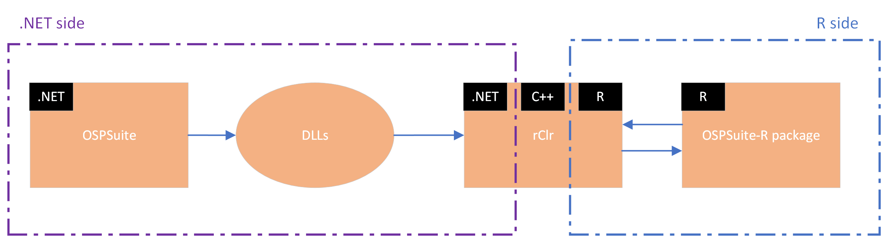

# OSPSuite Architecture

## Introduction

In this part of the documentation we will talk about the specifics of the [OSPSuite-R](https://github.com/Open-Systems-Pharmacology/OSPSuite-R) package. This is a package that offers the functionalities of OSPSuite to the R language. We will anaylize its elements and code structure, as well as the components that enable us to interface between the OSPSuite codebase in the .NET universe and the R programming language. 

## OSPSuite-R communication with .NET

As mentioned, through the OSPSuite-R package we get OSPSuite functionalities available in the R programming language. Those OSPSuite functionalities though have been developed and exist in the .NET universe. In order to provide them in R we have to enable communication bewtween R and .NET. To do this we are currently using the [rClr package](https://github.com/Open-Systems-Pharmacology/rClr). This package allows the communication between R and .NET using C++ as an intermediate layer. .NET can communicate with C++ using a custom native host and C++ can then communicate with R through the R .C interface. This is why we need to have the rClr package installed in R for OSPSuite-R to work. Using rClr we can load the dlls produced from the .NET code and use them.



## OSPSuite-R code structure


The general file and code structure of the package follows the best practices of R packages. What is special in this package is that OSPSuite-R is strongly object-oriented. Usually R packages tend to be more functional-programming-oriented. This object-oriented tendency comes as a result of using many of the functionalities of PK-Sim and OSPSuite.Core, that are already structure in an object oriented way in .NET. 

### Initializing the package

As per convention with R packages, [zzz.R](https://github.com/Open-Systems-Pharmacology/OSPSuite-R/blob/develop/R/zzz.R) is the first file that gets executed when loading the package. This is the normal way that R packages work. In our case it does not do much more than check that we are running under the necessary x64 version of R and then call .initPackage(). [init-package.R](https://github.com/Open-Systems-Pharmacology/OSPSuite-R/blob/develop/R/init-package.R) then uses rClr to call the entry point of the OSPSuite-R package in the .NET code of OSPSuite.Core.


### Package entry point on the .NET side.

The entry point as well as the necessary preparations and interfacing in the .NET side of the OSPSuite exists in the [OSPSuite.R project](https://github.com/Open-Systems-Pharmacology/OSPSuite.Core/tree/develop/src/OSPSuite.R) of OSPSuite.Core. This also means in terms of compiled code that the entry point resides in the OSPSuite.R.dll. Specifically in the initialize function from the R side we load the OSPSuite.R.dll and call InitializeOnce() on the .NET side through rClr.

[init-package.R](https://github.com/Open-Systems-Pharmacology/OSPSuite-R/blob/develop/R/init-package.R) on the R package side.
```
.
.
.

rClr::clrLoadAssembly(filePathFor("OSPSuite.R.dll"))

.
.
.

rClr::clrCallStatic("OSPSuite.R.Api", "InitializeOnce", apiConfig$ref)
```


[Api.cs](https://github.com/Open-Systems-Pharmacology/OSPSuite.Core/blob/develop/src/OSPSuite.R/Api.cs) in OSPSuite.Core on the .NET side.
```
.
.
.

public static void InitializeOnce(ApiConfig apiConfig)
{
    Container = ApplicationStartup.Initialize(apiConfig);
}
```
On the .NET side, the [OSPSuite.R project](https://github.com/Open-Systems-Pharmacology/OSPSuite.Core/tree/develop/src/OSPSuite.R) of OSPSuite.Core contains all the code that takes care of the necessary preparations (minimal implementations, container registrations, entry points for R calls, taks creation etc.) for the interfacing for the R package. Specifically the `InitializeOnce` function takes care of the necessary registrations and loads the dimensions and PK parameters from the corresponding xmls.

### Object oriented design and rClr encapsulation

Then the package creates in the R universe objects that corresponds to the OSPSuite objects of the .NET universe. In order to facilitate this on the R side we are creating wrapper classes for all those objects. In R there are various object-oriented frameworks, but in the case of OSPSuite-R we are using [R6](https://r6.r-lib.org/) to create objects and work with them. 

This wrapper is defined in the dot-net-wrapper class

code snippet

So when a .NET object is created and then with the help of rClr passed over to R, we are wrapping it with an object of this class. All the classes for OSPSuite objects used in the package inherit from this parent class.

then we have entity, base object aso that are main categories of objects in the package and they inheri then directly aso.

In order to keep things well organized, classes are defined in separate files that are named after the class ( f.e. class simulation is defined in file simulation.R).

-- check what we have in the definition and what in then "extensions"
For something more complicated we can showcase a simulation:


-- what happens when we create a new object:(10')

In R6 the initialize function works as the class constructor.

(do we have in this file the methods necessary to create the object -and set things)

then in a separate (one could say extension-like) file we have methods that "work" on those objects that exist in the utilities files (example here)


creating a new object always goes through an rClr call to the .NET code, that creates the object and returns ot to R. Then we create a new wrapper object in R and encapsulate the reference of the .NET object. So the wrapper constructor always receives a reference to an rClr object. 

The user does not need to directly call rClr functions, or interface with rClr in any other way. All those functionalities that require rClr calls are encapsulated in the code of these wrapper objects and their utilities.

the wrapper has getters and setters for the object. Of course those as well go through the clr:Get (check how this is written) and clr:Set functions of rClr - which are not reveiled to the user of thre package. (15') - so usually let's say the rClr calls are done within the wrapper class.

exposing of the object properties to user and the reast of the package (fe readonly properties like path of the simulaiton) also happens through the wrapper.

most object come from object base (so all objects that need to have Name and Id)


show some code examples fe (21') we can go through the whole chain of calls for a readonly property. 

I am guessing we only get readonly properties. it makes little sense to get something editable / just check if we ever call clr:get in any other point.

--- in tests we have sample code


new .NET classes should also be in a separate class/file and so on , and then expose the public properties of the class with R6 through the wrapper. rClr calls should not be visible to the user of the package.
- ideally also not in the utilities, but this is actually not true in the package. (check a bit the uitilities code actually)


--- to also check: every class in R corresponding to a .NET class should implement a meaningful print method.(26')

(29') we do not always have a separate class in R for .NET objects. Sometimes there are "intermediate" objects that just get created and used in .NET and we let them just exist there. A good example for this is the dimension (also has_dimension in utilities units and the dimension_task)


### Tasks and taks cache
--- then we also have to check the dimensionTask in the OSPSuite Core end.

the communication between R and .NET is relatively slow, so we should also try to avoid passing objects from one to another of there is no explicit reason for this.
--especially for tasks.
that's why we are caching tasks for example and not creating or getting them anew every time we need them. we actually have a function that automatically checks if we have a task with that name in the cache, and if not we create it and add it to the cache.

also all internal functions to the package (meaning that they are not exposed to the user) are named beggining with a dot.

here example:

So also note and we need an example: in the init we establish the communication with the .NET dlls through rClr. also add a link to the ospsuite.R repository in Core.


## Updating Core dlls

The R package keeps local copies of the necessary dlls coming from OSPSuite.Core and PK-Sim that are necessary for it to function. When a newer version of teh .NET codebase is available, those dlls need to be updated manually. Those dlls reside under [OSPSuite-R/inst/lib/](https://github.com/Open-Systems-Pharmacology/OSPSuite-R/tree/develop/inst/lib). Let's take f.e. the case for updating the dlls for a change in OSPSuite.Core. [Appveyor](https://ci.appveyor.com/) (which is OSPSuite continuous integration tool) builds the nightly of the updated develop branch. The build of the nightly creates some artifacts, under which als exist the dlls that need to be copied to `OSPSuite-R/inst/lib/`:


inst/lib are the dlls. Most of them come from Core, 

...but there are a few PKSim ones ()
????.config nuget : not sure how this works, probably just for appveyor??? 

after updating you have to push


(55') also let's do screenshots for the nightly f.e.

and we have to check a bit what we do with the nuget versioning. 
we actually need the dlls in the package/repository, so we can make it work also without OSPSuite code. 

# Repository Submodules

Exactly the same as with PKSim and MoBi repositories, the OSPSuite.R repository shares some common submodules 

* [scripts](https://github.com/Open-Systems-Pharmacology/build-scripts) that contains scripts for bulding, updating and so on.

* [PK Parameters](https://github.com/Open-Systems-Pharmacology/OSPSuite.PKParameters) that contains a list of PK Parameters supported by the OSPSuite

* [Dimensions](https://github.com/Open-Systems-Pharmacology/OSPSuite.Dimensions) that contains a list of dimensions supported by the OSPSuite

Supported PK Parameters and Dimensions are read on loading of the R package from the xml file that comes from the submodules. This means that when for example a new supported dimension is to be added for the OSPSuite, it need to be added only to the subrepository and is automatically available in all other projects. 
